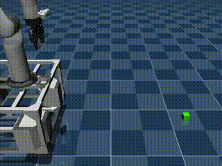
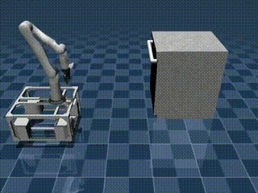
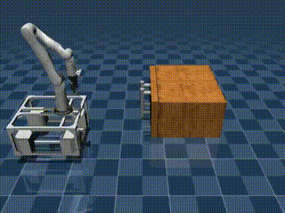

# HoMeR

[](https://homer-manip.github.io/assets/paper.pdf)  
[](https://homer-manip.github.io)

---

## Overview

**HoMeR** (Hybrid Whole-Body Policies for Mobile Robots) is a hybrid imitation learning framework for mobile manipulation. It combines whole-body control with a hybrid action representation to achieve generalizable and precise robot behavior in both simulation and real-world settings.

<table>
  <tr>
    <td></td>
    <td></td>
    <td></td>
  </tr>
  <tr>
    <td></td>
    <td></td>
    <td></td>
  </tr>
</table>


---

## Quick Start

Depending on your use case, please follow the appropriate setup and usage instructions:

### 🖥️ Simulation-Only

If you are **only using simulation**, refer to:

📄 [`SIM.md`](SIM.md)

This guide covers:
- Conda setup on macOS and Linux
- Simulated data collection and annotation
- Training and evaluating HoMeR and baselines in simulation

---


## Todo（For EMO project）:
对于dishwasher任务：采集-28 to 28度的位置角度不同的正对目标物体的数据训练一手，base的位置和角度可以在/envs/common_mj_env.py 中按照以下说明内容进行修改：

def reset(self):                              
        # Initialize base at origin
        # self.qpos[:] = np.zeros(3)
        self.qpos[:] = np.array([0.4, 0.1, 0])  #x轴是前后，y轴是上下, θ 是弧度表示Z 轴的旋转角度:θ = 0：朝向 x 正方向；
                                                                    θ = π/2 ≈ 1.57：朝向 y 正方向；
                                                                    θ = π ≈ 3.14 或 -π ≈ -3.14：朝向 -x；
                                                                    θ = -π/2 ≈ -1.57：朝向 -y。

以下位置数据采集并训练，如何采集和训练参照📄 [`SIM.md`](SIM.md)
| 角度 (°) | θ (rad) | yaw = -θ (rad) | `[x, y, yaw]`            |
| ------ | ------- | -------------- | ------------------------ |
| -28     | -0.489 | **+0.489**     | \[0.354, -0.189, 0.489]  | 
| -21    | -0.366  | **+0.366**     | \[0.374, -0.143, 0.366]  |
| -14    | -0.244  | **+0.244**     | \[0.390, -0.097, 0.244]  |
| -7     | -0.122  | **+0.122**     | \[0.398, -0.049, 0.122]  |
| 0      | 0       | **0**          | \[0.400, -0.000, 0.000]  |
| 7      | 0.122   | **-0.122**     | \[0.398,  0.049, -0.122] |
| 14     | 0.244   | **-0.244**     | \[0.390,  0.097, -0.244] |
| 21     | 0.366   | **-0.366**     | \[0.374,  0.143, -0.366] |
| 28     | 0.489   | **+0.489**     | \[0.354,  0.189, -0.489] | 


需求（For Qin Zhu）:
每个位置采集20条数据（共9组180条），分别训练三个模型：1.-28 -21 -14 -7 0 -7 14 21 28  2.-28 -14 0 14 28    3.-28 0 28
然后eval一手，按照从-42度以3.5度一路到42度（共24个角度，具体位置需要麻烦计算一手）每个角度eval 20次，统计一手成功率


## Repository Structure

```bash
cfgs/                 # Training config files
envs/                 # Environment setup for sim and real
docker/               # Real-world Docker setup
scripts/              # Training and evaluation scripts
interactive_scripts/  # Data collection, replay, and data annotation tools
dataset_utils/        # Dataset loading and data visualization tools
mj_assets/            # MJCF assets for simulation
sbatch_scripts/       # SLURM scripts to launch training jobs

