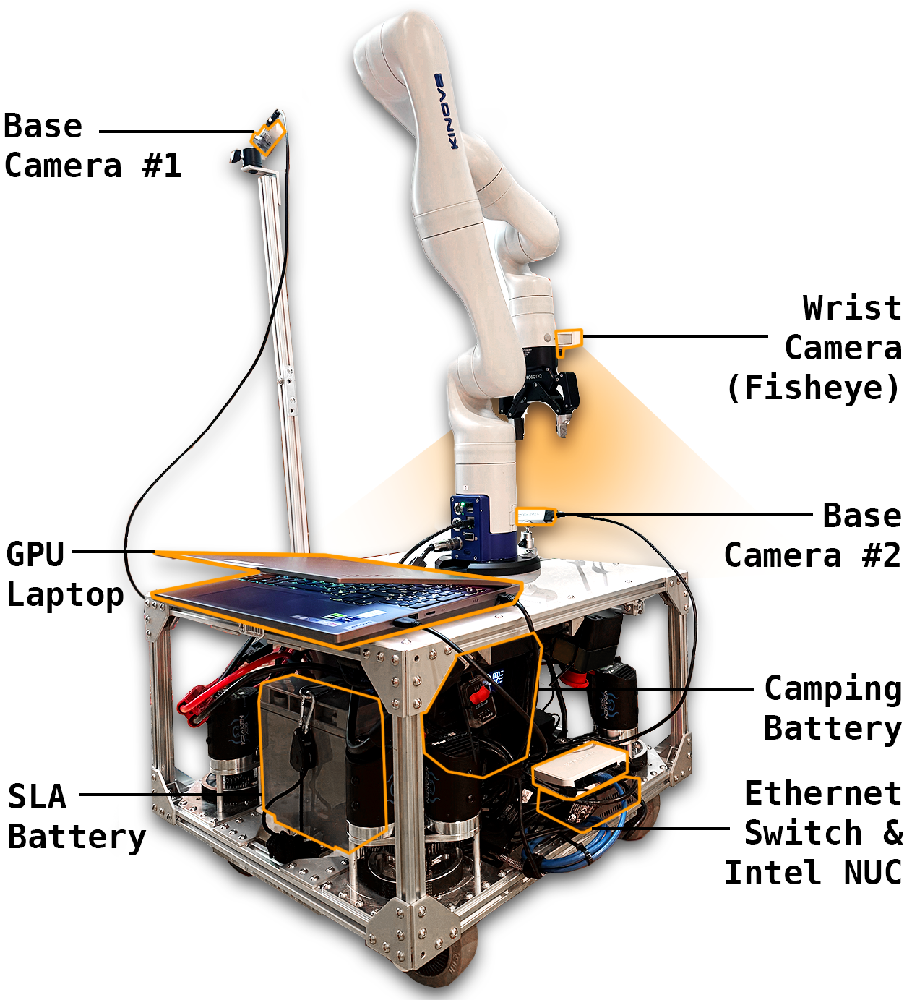

### Setup

This README contains all the info for real-robot deployment of HoMeR. We highly recommend first testing out dataset collection / teleoperation / training / evalulation piplines in [sim](SIM.md) first.

---

### 1. Robot Platform: Tidybot++

Please follow Jimmy's detailed hardware assembly and setup guide to build the Kinova-compatible **Tidybot++** platform, and set up the `tidybot2` repo on the NUC:  
📄 https://tidybot2.github.io/docs/

> **Note**: You can omit the Logitech base webcam from the build.


> **Note**: Ensure that [`constants.py`](https://github.com/jimmyyhwu/tidybot2/blob/main/constants.py) is properly configured, specifically `ENCODER_MAGNET_OFFSETS`, otherwise you may have issues with the base not driving straight, or unusual vibrating noises

#### ✅ Sanity Check
Ensure the robot is operable by SSHing into the onboard NUC and running:
```bash
python main.py --teleop --save --output-dir data/demos
```
> **Debugging Tip**: If this errors, in [`real_env.py`](https://github.com/jimmyyhwu/tidybot2/blob/main/real_env.py#L31) you can comment out these lines to disable camera-streaming and re-run the script to minimally test that the robot itself is teleoperable, ignoring cameras:
  ```bash
  self.base_camera = LogitechCamera(BASE_CAMERA_SERIAL)
  self.wrist_camera = KinovaCamera()
  ...
  obs['base_image'] = self.base_camera.get_image()
  obs['wrist_image'] = self.wrist_camera.get_image()
  ...
  self.base_camera.close()
  self.wrist_camera.close()
  ```

See the [data collection guide](https://tidybot2.github.io/docs/usage/#data-collection) for details.

---

### 2. Hardware Requirements

- **GPU Laptop**  
  We used a [Lenovo Legion 5i](https://www.costco.com/lenovo-legion-5i-16%22-gaming-laptop---14th-gen-intel-core-i9-14900hx---geforce-rtx-4060---165hz-2560-x-1600.product.4000270759.html), but any gaming laptop with an NVIDIA GPU (e.g. Alienware) should work.  
  💡 In our setup, the laptop sits on top of the mobile base and can optionally be powered via the AC power strip in the base.

- **Ethernet Switch and Cables**  
  We used a [Netgear 5-port Gigabit switch](https://www.bestbuy.com/site/netgear-5-port-10-100-1000-mbps-gigabit-unmanaged-switch-white/6840341.p?skuId=6840341) along with **three Ethernet cables**:
  - Kinova → Switch  
  - NUC → Switch  
  - GPU Laptop → Switch

- **Cameras**  
  - **Wrist Camera**: Built into the Kinova arm, with an external [fisheye lens](https://tidybot2.github.io/docs/arm-mounting/#wrist-camera).  
  - **Third-Person Views**: Two Intel RealSense D435 RGB-D cameras mounted to the robot base using [extra rails](https://tidybot2.github.io/docs/frame/#parts), along with **2 USB 3.0 Micro-B to USB-A cables.** In practice, we used the ball mounts that come with the RealSenses to attach to the rails.

- **Optional (Recommended)**  
  - An **Ethernet-to-USB-C adapter** and one extra Ethernet cable, for **wired iPhone teleoperation**. This avoids Wi-Fi instability during data collection in environments with weak or congested networks.

- **Images**  



---

### 3. Software Setup

The system is split across two machines:

- **NUC**: Executes low-level real-time control
- **GPU Laptop**: Handles image processing, policy inference, and sending actions to the real-time controllers running on the NUC

You must clone this repo on **both machines**.

#### 🖥️ A. NUC Setup

Ensure that the NUC and GPU Laptop are each connected via ethernet cable to a common ethernet switch. We will use the ethernet interface to communicate between the two.

One-time setup:
- Clone the repo:
```bash
git clone https://github.com/priyasundaresan/homer.git
cd homer
```
- Configure constants:
  - In `constants.py`, set `BASE_RPC_HOST` and `ARM_RPC_HOST` to be the ethernet IP address of the NUC. (Check `ifconfig -a`, look for something like `eth0`)

Once every shell session on the NUC:
```bash
source set_env.sh # This activates the tidybot2 conda env, which should already be installed following Jimmy's setup.
```

#### 💻 B. GPU Laptop Setup

One-time setup:
- Set up the repo
```bash
git clone https://github.com/priyasundaresan/homer.git
cd homer
cd docker
./docker_build.py   # run once
```
- Configure IP address/constants:
  - In `constants.py`, set `BASE_RPC_HOST` and `ARM_RPC_HOST` to be the ethernet IP address of the GPU laptop. (Check `ifconfig -a`, look for something like `eth0`)
  - Essentially, you need the GPU laptop and the NUC to be on the same subnet. Confirm that the `BASE_RPC_HOST`, `ARM_RPC_HOST` AND `TELEOP_HOST` ip addresses in `constants.py` are on the same subnet (i.e. `192.168.1.X`). 
  > **Debugging Tip**: A good sanity check is ensuring you can ping the NUC from the GPU laptop, and vice versa, when all are connected via Ethernet switch.

Once every shell session on the GPU laptop:
```bash
./docker_run.py # run each time
source set_env.sh
...
# Ctrl + D to detach from docker container
```
---

## Prerequisite: Start Arm & Base Servers on the NUC

Before running any of the following steps for **camera calibration**, **data collection**, or **evaluation**, you must ssh to the NUC and start the control servers on the NUC.

First, power on the robot:
- Ensure that the camping battery is charged
- Ensure that the SLA batteries of the base are fully charged, inserted into the robot base, and that the red adapters are plugged into each other
- Ensure that the Kinova has been powered on: press/hold the power button until the LED flashes blue once, then release, and wait for it to start blinking. After ~10 seconds, it should flash green, power on, and the gripper should open.

Open two terminals on the NUC (we suggest `screen` or `tmux`) and run the following.

Terminal 1:
```bash
cd homer
source set_env.sh
python envs/utils/arm_server.py
```

Terminal 2:
```bash
cd homer
source set_env.sh
python envs/utils/base_server.py  
```

All subsequent commands assume these two processes are running.
> **Debugging Tip**: "Voltage too low" warning indicates you may have forgotten to plug in the SLA batteries

---

### 4. Camera Setup (Calibration)


To enable accurate multi-view point clouds as in our setup, you must calibrate the RealSense cameras mounted on the robot base.

#### Step-by-Step Instructions

1. **Mount and Connect Cameras**  
   Ensure the two Intel RealSense D435 cameras are mounted to the base and have a clear view of the end-effector. Connect them to the **GPU laptop** via USB.
   In our setup, we used one RealSense mounted at the front of the base angled downwards for objects on the floor, and another on a taller stand on the side of the base, for table-height tasks. We connected the cameras using the provided ball mounts that came with the RealSenses, and extra mounting rails identical to those used to create the base.

2. **Ensure Cameras Operational**
    The easiest way to do this is to open `Realsense Viewer` on Linux, ensure that the cameras are recognized, and that you can toggle RGB/Stereo Mode. You also may be prompted to upgrade the firmware of the cameras in case they are out of date. If you have `librealsense` instealled, you should be able to launch the realsense viewer with `realsense-viewer`. In case you do not, you can pull the `librealsense` Docker image to run a container containing all the necessary dependencies. This is much easier than installing `librealsense` from source:
   - `docker pull librealsense/librealsense`
   - `cd docker`
   - `./rs.py`: This is a simple script we provide to launch a Docker container containing the `librealsense` package and enable the necessary USB permissions to access cameras.
   - Now, you should be able to run `realsense-viewer` and other useful utilities like `rs-enumerate-devices` to get info on the cameras.
   

3. **Update Camera Configs**  
   Update the following config files with the correct RealSense serial numbers:
   - `envs/cfgs/real_wbc.yaml`
   - `envs/cfgs/real_base_arm.yaml`  


   > **Debugging Tip:** You can get serial numbers using:

   ```bash
   rs-enumerate-devices | grep Serial
   ```
   Use the value from `Serial No.`, **not** `ASIC Serial`.


   OR


   ```python
   import pyrealsense2 as rs

   ctx = rs.context()
   for device in ctx.query_devices():
       print("Serial Number:", device.get_info(rs.camera_info.serial_number))
   ```
4. **Create a folder to store extrinsics/intrinsics**  
   ```bash
   mkdir calib_files
   ```

5. **Print and Prepare ArUco Marker**  
   Print the file:  
   `calib_scripts/aruco_marker_id0_50mm.pdf`  
   > **Note**: We generated this with `python calib_scripts/generate_calib_marker_pdf.py`
   Cut out the marker and paste it onto a piece of cardboard.

6. **Collect Calibration Images**  
   Run the calibration data collection script:
   ```bash
   python calib_scripts/move_calib.py
   ```
   - Place the ArUco tag in the robot gripper.
   - Press **Enter** to close the gripper (⚠️ watch your fingers).
   - The robot will automatically move to various poses and capture images from the RealSense cameras.

   > **Debugging Tips**:
     > If having issues, first check that the Realsense cameras are plugged into the GPU laptop.
     > Then, you can check that the cameras are correctly observing images by running `python envs/utils/cameras.py` (just make sure to update `base1_camera = RealSenseCamera("247122072471", use_depth=1)` and `base2_camera = RealSenseCamera("247122073666", use_depth=1)` with the correct serial numbers in your setup. This will visualize all the camera streams.
     > Finally, check that the NUC/GPU laptop/Kinova are all connected to the Ethernet switch, and that `base_server.py` and `arm_server.py` are running on the NUC side (see [Shared Prerequisite](#prerequisite-start-arm--base-servers-on-the-nuc)).

7. **Solve for Camera Extrinsics**  
   After running `move_calib.py`, we run the following:
   ```bash
   python calib_scripts/solve_calib.py
   ```
   The script currently visualizes each camera image and the detected Aruco tag, so press `q` to close each image.
   This computes camera-to-robot transforms and saves them to `calib_files/`.

8. **[Optional, Recommended] Refine Alignment via ICP**  
   After running vanilla calibration with `solve_calib.py`, sometimes the merged point cloud from each camera has gaps or is not overlapping, due to calibration / sensor noise. To ensure consistent alignment between the point cloud from both base cameras:
   - Place a medium-sized object (e.g. shoebox) in front of the robot.
   - Run:
     ```bash
     python calib_scripts/refine_calib.py
     ```
   This performs ICP to align the two camera point clouds and uses the solved transformation to align the extrinsics of base 2 camera relative to base 1 camera in `calib_files/`. It will also visualize the merged point cloud and alignment result. 

9. **Visualize Final Point Cloud**  
   Confirm calibration quality:
   ```bash
   python interactive_scripts/vis_pcl.py --env_cfg envs/cfgs/real_<wbc,base_arm>.yaml
   ```
   This will display the deprojected and merged point cloud using the extrinsics from `calib_files/`. This point cloud should look well stitched (no obvious gaps). You can adjust the following parameters of the environment config file (`real_<wbc,base_arm>.yaml`) which specifies the point cloud cropping bounds. This is the bounds of the point cloud w.r.t. the base of the arm. 
   ```bash
   min_bound: [0.2, -0.5, -0.35]
   max_bound: [1.0, 0.5, 0.3]
   ```
   For instance, we currently set the z-min to be 35cm. below the arm (close to the floor), since the base height is ~37cm, and 30 centimeters above the arm (along the z axis). We also use 20cm. to 1meter in front of the arm (along x), and 50cm. to the left/right of the arm (along y). We found these bounds to work well across the real-world tasks considered.

---

### 5. Data Collection

#### 🕹️ A. Teleoperation

We support two teleoperation modes:

---

##### 1. Base + Arm Mode

This mode allows you to control the arm and mobile base in a decoupled fashion (same as normal Tidybot++).

```bash
python interactive_scripts/record_real.py --env_cfg envs/cfgs/real_base_arm.yaml
```

---

##### 2. Whole-Body Mode (HoMeR)

This mode enables whole-body teleoperation using a [`mink`](https://github.com/kevinzakka/mink)-based IK solver for both the full kinematic chain of the base + arm.

```bash
python interactive_scripts/record_real.py --env_cfg envs/cfgs/real_wbc.yaml
```

- This script relies on the WBC IK solver in `envs/utils/wbc_ik_solver_real.py`
  - By default, collision avoidance is disabled. To enable collision avoidance between arm/base/camera mounts, uncomment [this](envs/utils/wbc_ik_solver_real.py#L75) and comment out [this](envs/utils/wbc_ik_solver_real.py#L76).
    - We configure the placement of the external camera mounts [here](mj_assets/stanford_tidybot2/tidybot_cam_mounts.xml#L109), which you can update if your setup places camera mounts differently.

> **Debugging Tips**:
Ensure that the RealSense cameras are plugged into the GPU laptop, that the NUC/GPU laptop/Kinova are all connected to the Ethernet switch, and that `base_server.py` and `arm_server.py` are running on the NUC side (see [Shared Prerequisite](#prerequisite-start-arm--base-servers-on-the-nuc)).

---

#### ⚙️ Teleop Setup Instructions
We highly recommend trying teleoperation [in simulation](SIM.md#data-collection) first before moving to real.

1. **iPhone Setup**
   - Install the [XRBrowser app](https://apps.apple.com/us/app/xr-browser/id1588029989).
   - Connect the iPhone to the same network as the GPU laptop:
     - **Wired (recommended):** Use a USB-C → Ethernet adapter and plug into the same switch as the GPU laptop.  
       On the iPhone, go to `Settings → Ethernet` and manually assign an IP on the same subnet (e.g. `192.168.1.Y`) as the GPU laptop. Choose an IP that is different from the NUC/GPU laptop. 
       Set `TELEOP_HOST` in the script to the **GPU laptop's Ethernet IP**.
     - **Wireless (less stable):** Join the same Wi-Fi network as the GPU laptop.  
       Set `TELEOP_HOST=0.0.0.0`.

2. **Start the Script**  
   Launch one of the commands above. It will automatically host a control webpage.

3. **Connect from iPhone**
   - Open XRBrowser on the iPhone.
   - Paste the URL shown in the terminal into the browser.
   - You should see a webpage that says **"Start Episode"**.

4. **Align the iPhone**  
   It is **critical** that the phone is aligned properly with the end-effector for accurate control.  
   Refer to this guide: [📄 Alignment Example](https://tidybot2.github.io/docs/usage/#connecting-the-client)

5. **Control the Robot**
   - Tap **"Start Episode"** on the phone.
   - Controls:
     - 🟦 Center press → End-effector control
     - 🔴 Right press → Base control
     - ↕️ Swipe up/down → Open/close gripper  
   - Example usage: [📄 Interface Example](https://tidybot2.github.io/docs/usage/#controlling-the-robot)

6. **Save the Demo**
   - Tap **"End Episode"** on the phone when complete.
     > **Note**: ⚠️  Upon hitting `End Episode`, the robot automatically attempts to `Reset` to a neutral joint configuration. This is a sweeping motion to straighten out the joints, so it is important to ensure there are no objects or things in the environment that could potentially collide with the arm when you press this button.
   - Demos are saved under:  
     ```bash
     data/dev1/demoXXXXX.pkl
     ```

> **Debugging Tip**: If the script complains that port `5001` is in use:
     ```bash
     ps aux | grep record_real.py
     kill -9 <PID>
     ```

> **Note**: In our experiments, we collected **20 teleoperated demos per real-world task**.

-----

#### 🏷️ B. Annotation

The output of teleoperation is saved in the folder:

```
data/dev1/
```

To prepare this dataset for training, you must perform two post-processing steps:
1. **Mode Annotation** — label which segments use keypose vs. dense control
2. **Salient Point Annotation** — specify a 3D task-relevant point per keypose frame

These steps are identical to what we do for the simulated setup. Please refer to the following sections in `SIM.md`:

- [Annotate Modes](SIM.md#step-2-annotate-modes)
- [Annotate Salient Points](SIM.md#step-3-annotate-salient-points)

Once complete, this will result in `dev1_relabeled` which you can rename to your desired dataset name. 

-----

---

### 6. Training
Train your hybrid policy using the annotated data. Both keypose and dense components must be trained separately.
- See [Training](SIM.md#training)
> **Note**: We trained all keypose policies externally on `l40s` GPUs, and all dense policies on `a40` or `a5000` GPUs, not on the GPU laptop used in deployment. 

---

### 7. Evaluation

Before running any policy, ensure the **NUC is running both the arm and base servers**.  
(Refer back to the [Shared Prerequisite](#prerequisite-start-arm--base-servers-on-the-nuc))

We use the **iPhone interface** to:
- Drive the robot to reset/start positions
- Trigger policy execution via a webpage

---

#### Setup

1. **Edit `constants.py`**  
   Set the following value to enable using your iPhone as wireless enabling device to start/stop rollouts and reset the robot:
   ```python
   TELEOP_HOST = "0.0.0.0"
   ```

2. **Run the evaluation script** (see below)

3. **On your iPhone**  
   - Open XRBrowser, ensure your iPhone is on the same Wi-Fi network as the GPU laptop.
   - Paste in the URL printed by the script 
   - When prompted (purple screen), use iPhone controls to teleop the robot to its start position (Use `Start/End Episode`). This allows you to drive the base back to a starting position by pressing and holding the right side of the screen (it should highlight in red).
   - Tap **Start Episode** to run the policy, and **End Episode** to end. (⚠️  Make sure to hit `End Episode` if the robot is in a strange configuration, or at collision risk. Note that upon hitting `End Episode`, the robot automatically attempts to `Reset` to a neutral joint configuration. This is a sweeping motion to straighten out the joints, so it is important to ensure there are no objects or things in the environment that could potentially collide with the arm.).

---

#### 📌 Evaluation Commands (Ex: TV Remote Task)

**HoMeR (Whole-Body Control + Hybrid Actions):**
```bash
python scripts/eval_hybrid_real.py \
  -w exps/waypoint/remote_wbc/latest.pt \
  -d exps/dense/remote_wbc_delta_allcams/latest.pt \
  --num_episode 20 \
  -e envs/cfgs/real_wbc.yaml
```

**HoMeR-B+A (Base + Arm Control + Hybrid Actions):**
```bash
python scripts/eval_hybrid_real.py \
  -w exps/waypoint/remote_base_arm/latest.pt \
  -d exps/dense/remote_base_arm_delta_allcams/latest.pt \
  --num_episode 20 \
  -e envs/cfgs/real_base_arm.yaml
```

**DP-B+A (Base + Arm Control + Dense Actions Only):**
```bash
python scripts/eval_dense_real.py \
  -d exps/dense/remote_base_arm_delta_allcamsonly/latest.pt \
  --num_episode 20 \
  -e envs/cfgs/real_base_arm.yaml
```

**DP-WBC (Whole-Body Control + Dense Actions Only):**
```bash
python scripts/eval_dense_real.py \
  -d exps/dense/remote_wbc_delta_allcamsonly/latest.pt \
  --num_episode 20 \
  -e envs/cfgs/real_wbc.yaml
```

-----

