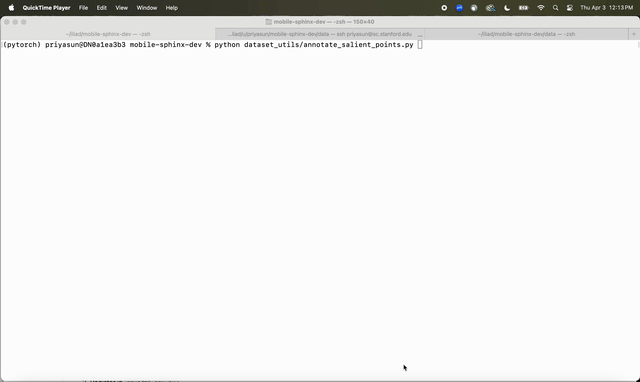

## Setup

### 1. Clone the repository

```bash
git clone https://github.com/priyasundaresan/homer.git
cd homer
```
---

### 2. Install dependencies

Use the provided `conda` environments:

- **`mac_env.yml`**: for data collection/development on **macOS**.
- **`linux_env.yml`**: for data collection/development and training/evaluation on **Linux workstations or clusters**.

Create the environment with:

```bash
mamba env create -f mac_env.yml    # if on macOS
# OR
mamba env create -f linux_env.yml  # if on Linux
```

### 3. Source environment variables

Once per shell session, run:

```bash
source set_env.sh
```
---

## Training

### 1. Download Datasets
First, create a directory to store datasets locally
```bash
cd /path/to/local/homer 
mkdir data
cd data
```
Then, to download any of our pre-collected datasets for sim tasks, you can use the following, where `task` is one of [`cube`, `dishwasher`, `cabinet`] and `action_space` is one of [`wbc` (HoMeR) or `base_arm` (baselines)]:
```bash
wget --no-check-certificate https://download.cs.stanford.edu/juno/homer/data/dev_<task>_<action_space>.tar.zst
tar --use-compress-program=unzstd -xvf dev_<task>_<action_space>.tar.zst
```
Locally, `homer/data` should now contain datasets such as `homer/data/dev_<cube/dishwasher/cabinet>_<wbc/base_arm>`.

### 2. Training

Our paper introduces two key agent variants:

- **HoMeR**: combines a keypose policy and a dense policy under a whole-body control (WBC) action space. The keypose policy predicts both salient points and end-effector actions.
- **HoMeR-Cond**: a variant of HoMeR where the keypose policy is externally conditioned on salient points at test time, rather than predicting them.

We compare against approaches which:
- Use decoupled base+arm control instead of WBC (**HoMeR-B+A**)
- Only use dense instead of hybrid actions (**DP-WBC**, **DP-B+A**)

---
### Ex: Open Cabinet Task

#### Train HoMeR

```bash
# WBC keypose policy (predicts salient points + actions)
python scripts/train_waypoint.py --config_path cfgs/waypoint/cabinet_wbc.yaml

# WBC dense policy
python scripts/train_dense.py --config_path cfgs/dense/cabinet_wbc_allcams.yaml
```

→ Checkpoints:
- `exps/waypoint/cabinet_wbc` (1)
- `exps/dense/cabinet_wbc_delta_allcams` (2)

#### Train Baselines (B+A Keypose and Dense)

```bash
# B+A keypose policy
python scripts/train_waypoint.py --config_path cfgs/waypoint/cabinet_base_arm.yaml

# B+A dense policy
python scripts/train_dense.py --config_path cfgs/dense/cabinet_base_arm_allcams.yaml
```

→ This results in the following checkpoints:
- `exps/waypoint/cabinet_base_arm` (3)
- `exps/dense/cabinet_base_arm_delta_allcams` (4)

#### Summary of Trained Agents

| Agent         | Components                    |
|---------------|-------------------------------|
| **HoMeR**      | (1) + (2)                      |
| **DP-WBC**     | (2) only                       |
| **HoMeR-B+A**  | (3) + (4)                      |
| **DP-B+A**     | (4) only                       |


These same commands will work for any other simulated task by updating the config paths accordingly.
 - `Dishwasher`: Replace all commands with `cfgs/waypoint/dishwasher_<wbc,base_arm>.yaml` and `cfgs/dense/dishwasher_<wbc,base_arm>_allcams.yaml` 
 - `Cube`: Replace all commands with `cfgs/waypoint/cube_<wbc,base_arm>.yaml` and `cfgs/dense/cube_<wbc,base_arm>_allcams.yaml`
---

### Ex: Cube Task

#### Train HoMeR-cond

```bash
# WBC keypose policy, externally conditioned on salient points
python scripts/train_waypoint_cond.py --config_path cfgs/waypoint/cube_wbc_cond.yaml
```

→ Checkpoint:
- `exps/waypoint/cube_wbc_cond`

---
We train all models across `l40s` or `a40` GPUs. The dense policies can be trained on smaller GPUs like `a40` or `a5000` within a few hours. The keypose model is a larger transformer, and we train it on a single `l40s` GPU (<6 hours). See the provided example scripts in `sbatch_scripts/` to launch training jobs on a cluster with SLURM.

## Evaluation

### 1. Download checkpoints locally
If you trained checkpoints using the procedure above, use:

```bash
cd /path/to/local/homer 
mkdir -p exps/dense
mkdir -p exps/waypoint
cd exps
rsync -av /path/to/remote/homer/exps/waypoint/* ./exps/waypoint/
rsync -av /path/to/remote/homer/exps/dense/* ./exps/dense/
```
To download pre-trained checkpoints, you can use the following commands, where `task` is one of [`cube`, `dishwasher`, `cabinet`] and `action_space` is one of [`wbc` (HoMeR) or `base_arm` (baselines)]:
```bash
cd /path/to/local/homer 
mkdir -p exps/dense
mkdir -p exps/waypoint
cd exps/waypoint
wget --no-check-certificate https://download.cs.stanford.edu/juno/homer/exps/waypoint/<task>_<action_space>.zst
tar --use-compress-program=unzstd -xvf <task>_<action_space>.zst
cd ../../dense 
wget --no-check-certificate https://download.cs.stanford.edu/juno/homer/exps/dense/<task>_<action_space>_delta_allcams.zst
tar --use-compress-program=unzstd -xvf <task>_<action_space>_delta_allcams.zst
```

Make sure that `homer/exps` now contains subfolders `waypoint` and `dense` with checkpoints per task.

### 2. Run evaluation

#### Sim Tasks

Open Cabinet
- HoMeR: 
```bash
python scripts/eval_hybrid.py -w exps/waypoint/cabinet_wbc/latest.pt -d exps/dense/cabinet_wbc_delta_allcams/latest.pt --num_episode 20 -e envs/cfgs/open_wbc.yaml
```
- HoMeR-B+A:
```bash
python scripts/eval_hybrid.py -w exps/waypoint/cabinet_base_arm/latest.pt -d exps/dense/cabinet_base_arm_delta_allcams/latest.pt --num_episode 20 -e envs/cfgs/open_base_arm.yaml
```
- DP-B+A:
```bash
python scripts/eval_dense.py -d exps/dense/cabinet_base_arm_delta_allcams/latest.pt --num_episode 20 -e envs/cfgs/open_base_arm.yaml
```
- DP-WBC:
```bash
python scripts/eval_dense.py -d exps/dense/cabinet_wbc_delta_allcams/latest.pt --num_episode 20 -e envs/cfgs/open_wbc.yaml
```

Open Dishwasher
- HoMeR: 
```bash
python scripts/eval_hybrid.py -w exps/waypoint/dishwasher_wbc/latest.pt -d exps/dense/dishwasher_wbc_delta_allcams/latest.pt --num_episode 20 -e envs/cfgs/dishwasher_wbc.yaml
```
- HoMeR-B+A:
```bash
python scripts/eval_hybrid.py -w exps/waypoint/dishwasher_base_arm/latest.pt -d exps/dense/dishwasher_base_arm_delta_allcams/latest.pt --num_episode 20 -e envs/cfgs/dishwasher_base_arm.yaml
```
- DP-B+A:
```bash
python scripts/eval_dense.py -d exps/dense/dishwasher_base_arm_delta_allcams/latest.pt --num_episode 20 -e envs/cfgs/dishwasher_base_arm.yaml
```
- DP-WBC:
```bash
python scripts/eval_dense.py -d exps/dense/dishwasher_wbc_delta_allcams/latest.pt --num_episode 20 -e envs/cfgs/dishwasher_wbc.yaml
```

Cube
- HoMeR: 
```bash
python scripts/eval_waypoint.py -w exps/waypoint/cube_wbc/latest.pt --num_episode 20 -e envs/cfgs/cube_wbc.yaml
```
- HoMeR-B+A:
```bash
python scripts/eval_waypoint.py -w exps/waypoint/cube_base_arm/latest.pt --num_episode 20 -e envs/cfgs/cube_base_arm.yaml
```
- DP-B+A:
```bash
python scripts/eval_dense.py -d exps/dense/cube_base_arm_delta_allcams/latest.pt --num_episode 20 -e envs/cfgs/cube_base_arm.yaml
```
- DP-WBC:
```bash
python scripts/eval_dense.py -d exps/dense/cube_wbc_delta_allcams/latest.pt --num_episode 20 -e envs/cfgs/cube_wbc.yaml
```
- HoMeR-Cond: 
```bash
python scripts/eval_waypoint_cond.py --model exps/waypoint/cube_wbc_cond/latest.pt --env_cfg envs/cfgs/cube_wbc.yaml # Vanilla Cube Env
python scripts/eval_waypoint_cond.py --model exps/waypoint/cube_wbc_cond/latest.pt --env_cfg envs/cfgs/cube_wbc_size.yaml # Varied Cube Size
python scripts/eval_waypoint_cond.py --model exps/waypoint/cube_wbc_cond/latest.pt --env_cfg envs/cfgs/cube_wbc_distractor.yaml # Distractors
python scripts/eval_waypoint_cond.py --model exps/waypoint/cube_wbc_cond/latest.pt --env_cfg envs/cfgs/cube_wbc_specified.yaml # Molmo-Prompted Cube
```

- All of the above scripts save videos and eval logs to `rollouts/` by default
- You can run `python scripts/parse_results.py rollouts` to get the success rates

---

## Data Collection

### Step 1: Teleoperate and record
Ex: Cube Task with WBC Action Space
- First, edit `constants.py` and set `TELEOP_HOST` to `0.0.0.0` or `localhost`
- Then:
```bash
source set_env.sh
python interactive_scripts/record_sim.py --env_cfg envs/cfgs/cube_wbc.yaml # Linux
# OR
mjpython interactive_scripts/record_sim.py --env_cfg envs/cfgs/cube_wbc.yaml # Mac
```

- Install the [XRBrowser](https://apps.apple.com/us/app/xr-browser/id1588029989) iPhone App
- Ensure your iPhone is on the same Wi-Fi network as your laptop/machine.
- Open XRBrowser on iPhone 
- Paste the link output in the Terminal by the script, and you should see a webpage load that says `Start Episode`
- Align the iPhone: It is very important that the iPhone is properly aligned in order to correctly map actions to the coordinate frame of the end-effector. Hold your iPhone face-up as you would normally, and then turn your torso 90deg. to your right. Now, there should be a 1:1 mapping of the iPhone to the end-effector, since your iPhone is now aligned with the robot (starts facing to the right).
- Press `Start Episode` and then you can teleoperate following these controls:
- Controls:
  - Center press → EE control (blue)
  - Right press → Base control (red)
  - Swipe up/down → Gripper
  - See [here](https://tidybot2.github.io/docs/usage/#controlling-the-robot) for an example of how the interface works.
- Press `End Episode` when you have successfully lifted the cube. There will be `stdout` feedback in the Terminal when `Success` is detected so you also know when to stop.
- Demos saved as: `dev1/demoXXXXX.pkl`

> **Debugging**:
  - If you run into: `TypeError: cannot pickle 'weakref' object` on Mac, avoid visualizing the images live by changing L24 to `env = MujocoEnv(env_cfg, show_images=False)` in `record_sim.py`
  - If the script complains about port `5001` being taken already, ensure no hanging processes are there (run `lsof -i 5001` and `kill -9` the hanging processes)

[Optional Sanity Check] Replay demos:
```bash
python interactive_scripts/replay_sim.py --data_dir dev1 # Linux
# OR
mjpython interactive_scripts/replay_sim.py --data_dir dev1 # Mac
```

NOTE: We collected 20 demos per simulated task in our experiments.

---

### Step 2: Annotate Modes
This step is necessary to post-process the demos which are collected in dense-only format into segments of keypose versus dense actions.
```bash
python dataset_utils/annotate_modes.py 
```

- Go to `http://127.0.0.1:5000`
- Follow instructions on the webpage! 


Outputs: `dev1_relabeled/`

---

### Step 3: Annotate Salient Points
```bash
python dataset_utils/annotate_salient_points.py
```


- Visualizes the point cloud for each keypose frame in the dataset (from `dev1_relabeled`)
- `Shift+Click`: Do this to annotate the desired salient point
- `q` / `Esc`: Go to the next keypose frame

Final labeled data: `dev1_relabeled/`  

Rename this folder to something more descriptive, move it to `data/`, and update your training config to use this new dataset (i.e. call it `data/dev_cube` then update `dataset/path` in `cfgs/waypoint/cube_wbc.yaml`). Then, you can train and eval following the **Training** and **Evaluation** subsections above.

---

## Adding Custom Tasks

1. Create XMLs:
   - `mj_assets/stanford_tidybot2/<task>.xml`
   - `mj_assets/stanford_tidybot2/tidybot_<task>.xml`

2. Create config:
   - `envs/cfgs/<task>_<wbc/base_arm>.yaml`

3. Register in `envs/mj_env.py`:
   - Update `__init__`
   - Update `reset_task`
   - Update `is_success`

4. Test:
```bash
mjpython interactive_scripts/record_sim.py --env_cfg envs/cfgs/<task>_<wbc/base_arm>.yaml
```
- Debugging tip:
  - If you get `ValueError: keyframe 0: invalid qpos size`, adjust the `home` keyframe in the XML to match joint dimensions.

---
